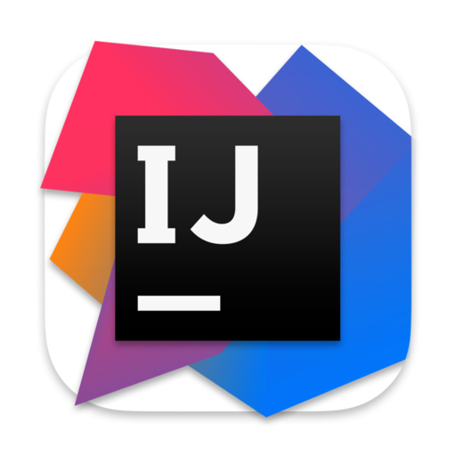

<!---
Karlroxas21/Karlroxas21 is a ✨ special ✨ repository because its `README.md` (this file) appears on your GitHub profile.
You can click the Preview link to take a look at your changes.
--->

  
  <h1>
    hey there
    
  </h1>

  

### About Me:
- I am a 3rd year student at National University- Manila taking BSIT-MAA.
- I want to create my own start up that can help a small group of people.
- Currently Exploring Web Development and IT Infrastructure
- Interested in Java, Algorithms, Infrastructure and Math(actually I am bad at math but I like it).
- In my free time, I read articles and I love watching tech videos.
- You can reach me at my email: supercrane21@protonmail.com

---

### Language and Tools I know:

  &nbsp;
  &nbsp;
  &nbsp;
   &nbsp;
   &nbsp;
   &nbsp;
   &nbsp;
   &nbsp;
   &nbsp;
   &nbsp;

